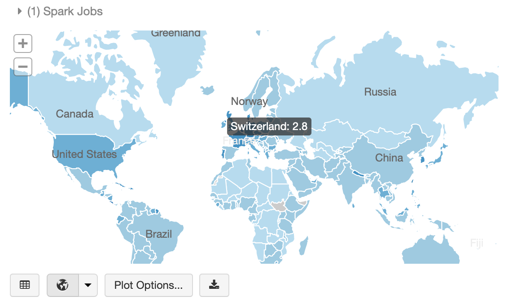

# databricks-geomesa
Geospatial analytics with GeoMesa on Databricks

Includes a Maven project to build a GeoMesa uber-jar compatible with Databricks (tested with Runtime 5.5), and a sample notebook.

To use the library, build the project with Maven and attach the library (in the target folder) to a Databricks cluster.